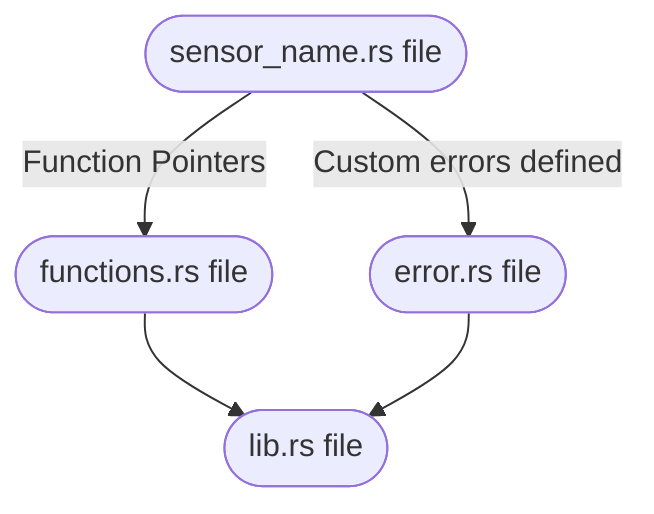
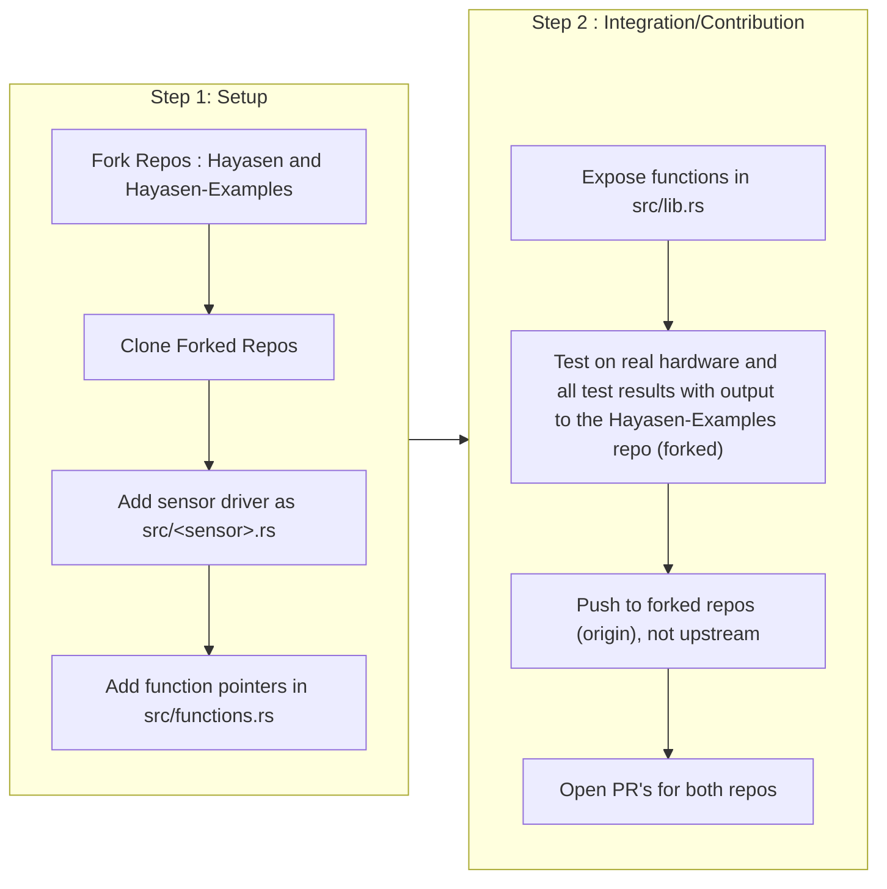
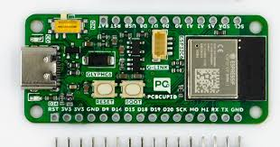
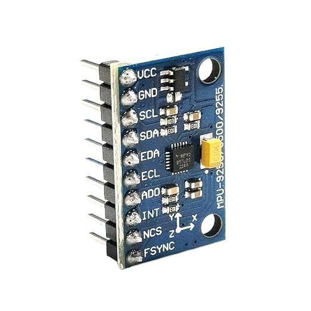

# WHO_AM_I

<!--column_layout: [1, 3]-->
<!--column: 0--> 

<!--new_lines: 5-->


<!--column: 1-->

```rust
fn main() {
  let WHO_AM_I: &str = "Vaishnav Sabari Girish";

  let designation: &str = "Final Year ECE Student";

  let mut interests: Vec<&str> = vec![
      "Open Source",
      "Embedded Systems",
      "Rust",
      "Linux",
      "CLI/TUI"
  ];

  let mut projects: Vec<&str> = vec![
      // Rust Projects
      "Hayasen",
      "ComChan (Serial Monitor)",
      "Arduino CLI Interactive",   // Except This one
  ];

  let website: &str = "https://vaishnav.world";
}
```
<!--end_slide-->

# Introduction to Hayasen

---


--- 

1. `hayasen` is an Embedded Rust library that supports multiple sensors for Embedded Systems.
2. It provides a type-safe and unified API to interact with various sensors.
3. Currently supports **MPU9250** and **MPU6050** IMUs. (Only I2C)
4. Support for more sensors on the way.

## Links

1. Github (Main repo) : [](https://github.com/Vaishnav-Sabari-Girish/Hayasen)
2. Github (Examples repo) : [](https://github.com/Vaishnav-Sabari-Girish/Hayasen-Examples)


<!--new_lines: 1-->
<!--alignment: center-->
**Contributions are Welcome**

<!--end_slide-->
# Problem Statement

1. Many sensor crates are **Outdated and Unmaintained**, leading to broken builds.
2. Lack of a **Unified Interface** -> Each sensor driver has it's own style and API.
3. Difficult for beginners to navigate **Error handling and Type safety**.


<!--end_slide-->

# How `hayasen` solves it 

1. Provides a **Unified Interface** and **Type-safe API** across supported sensors.
2. **Actively Maintained** with latest Rust crate versions and testing on latest MCU boards.
3. User-friendly API's which make it easier for beginners to navigate.
4. Robust Error handling with easy-to-understand **Custom Error Messages**.


<!--end_slide-->
# `Cargo.toml`

```toml
[package]
name = "hayasen"
version = "0.0.8"
edition = "2024"
description = "A multi sensor library for Embedded Rust supporting multiple sensors"
authors = ["Vaishnav-Sabari-Girish forgamesonly684@gmail.com"]
license = "MIT OR Apache-2.0"
repository = "https://github.com/Vaishnav-Sabari-Girish/Hayasen"
documentation = "http://vaishnav.world/Hayasen/"
keywords = ["embedded", "sensors", "driver", "no-std"]
categories = ["embedded", "no-std", "hardware-support"]
readme = "README.md"


[dependencies]
embedded-hal = "1.0.0"

[features]
default = []
mpu9250 = []
mpu6050 = []
```

<!--end_slide-->

# Project `src/` directory

```bash +exec
tree ./src/
```

<!--end_slide-->

# Project Structure 



<!--end_slide-->
# Function pointers in action

```d2 +render +width:100%
func: |md
`src/functions.rs`
|
func.shape: rectangle

sensor: |md
`src/<sensor>.rs`
|
sensor.shape: rectangle

main: |md
`src/lib.rs`
|

main.shape: rectangle

func.eg: |rust
pub verify_identity(): fn(&mut <sensor_struct><I2C>) -> Result<(), Error<E>>
|

sensor.eg: |rust
pub verify_identity(&mut self) -> Result<(), Error<E>> {
      // Code here
}
|

main.eg: |rust
sensor.verify_identity()
|

sensor.style.fill: transparent
sensor.eg.style.fill: transparent
sensor.eg.style.stroke: transparent


func.style.fill: transparent
func.eg.style.fill: transparent
func.eg.style.stroke: transparent


main.style.fill: transparent
main.eg.style.fill: transparent
main.eg.style.stroke: transparent

direction: down
sensor -> func -> main
```
<!--end_slide-->

# Why use a separate `functions.rs` file to store function pointers ? 

1. Each sensor gets its own struct of functions in functions.rs, keeping modules tidy and separate.
<!--new_lines: 1-->

2. lib.rs calls those per-sensor functions to build custom helpers and a friendly facade.

<!--new_lines: 1-->
3. **Result**: unified, consistent, feature‑gated API without allocations or messy cross-module coupling.


<!--end_slide-->

# Progress of the `hayasen` library

<!--new_lines: 2-->

## Completed
<!--alignment: center-->

| Sensor Tested  | Boards Used                                        |
| -------------- | --------------- |
| MPU9250 inertial measurement unit | Glyph C6                        |
|                                   |                                 |
| MPU6050 inertial measurement unit | Nordic nRF52840 Development Kit |


<!--new_lines: 1-->
<!--alignment: left-->
## In progress
<!--new_lines: 2-->
<!--alignment: center-->

| Sensor being tested | Board being used |
| -------------- | --------------- |
| BME280/BMP280 | Glyph C6 |

<!--end_slide-->

# Getting Started

## Adding the library using `cargo add`

```bash
cargo add hayasen --features mpu6050 # OR mpu9250
```

<!--new_lines: 1-->

<!--alignment: center-->
**OR**

<!--alignment: left-->
## Adding it to `Cargo.toml`

```toml
[package]
name = "<project_name>"
version = "0.1.0"
edition = "2024"

[dependencies]
embedded-hal = "1.0.0"
hayasen = { version = "0.0.8" , features = ["mpu6050"] }   # OR mpu9250
```

<!--end_slide-->

# Usage in program

## Example program (Generic) for MPU9250


```rust {1|3|5,8|11,12|14-18|20|all}
use hayasen::mpu9250_hayasen;   //Import the mpu9250_hayasen function

fn main() -> Result<(), Error<YourI2cError>> {
    // Setup I2C (platform-specific)
    let i2c = setup_i2c();
    
    // Initialize sensor with default configuration
    let mut sensor = mpu9250_hayasen::create_default(i2c, 0x68)?;
    
    // Read all sensor data (temp, accel, gyro)
    let (temperature, acceleration, angular_velocity) =
        mpu9250_hayasen::read_all(&mut sensor)?;
    
    println!("Temperature: {:.2}°C", temperature);
    println!("Acceleration: [{:.3}, {:.3}, {:.3}] g",
             acceleration[0], acceleration[1], acceleration[2]);
    println!("Angular Velocity: [{:.3}, {:.3}, {:.3}] dps",
             angular_velocity[0], angular_velocity[1], angular_velocity[2]);
    
    Ok(())
}
```

<!--end_slide-->

# Outputs - 1

## MPU9250


<!--end_slide-->

# Outputs - 2

## MPU6050


<!--end_slide-->

# Why Rust ?

The below points explain why I have used Rust to create `hayasen`

1. Robust **Error Handling** using `Result<>`
<!--new_lines: 1-->
2. Memory safety via **Ownership/Borrowing** avoid race conditions and undefined behaviour.

<!--new_lines: 1-->
3. Predictable performance from zero-cost abstractions suits real-time constraints.

<!--new_lines: 1-->
4. `no_std` support enables bare-metal firmware without OS or `std`.

<!--new_lines: 1-->
5. Portable drivers through `embedded-hal` traits across MCU's/HAL's

<!--new_lines: 1-->
6. **Ecosystem Gaps** : Some sensor crates are outdated or missing. Which is where `hayasen` comes in.

<!--new_lines: 1-->
7. Strong tooling (`cargo`, docs) speeds development and testing.

<!--end_slide-->

# Contributing



<!--end_slide-->
# Live Demo

## Hardware Used :

<!--column_layout: [1, 1]-->
<!--column: 0-->
### Glyph C6 (ESP32 C6 Mini)

This is a WiFi/Zigbee enabled ESP32C6 dev board built by [](https://shop.pcbcupid.com)
<!--new_lines: 1-->



<!--column: 1-->


### MPU9250 9-axis Inertial Measurement Unit

This is a 9-Axis IMU that can measure Acceleration (3-axis), Angular Velocity (3-axis) and Magnetic field (3-axis magnetometer)



<!--end_slide-->

# What's next ?

1. Add sensor support for more commonly used sensors like MAX30102, MQ135, Ultrasonic sensor etc.
<!--new_lines: 1-->
2. Add `async` support using `embedded-hal-async`

<!--new_lines: 1-->
3. Add SPI support for sensors which support both I2C and SPI like MPU9250 and MPU6050.

<!--new_lines: 1-->
4. Add a parameter which shows how much RAM or Flash each sensor uses for better memory management.


<!--end_slide-->


<!--end_slide-->

# All my links

1. **GitHub** : [](https://github.com/Vaishnav-Sabari-Girish)
<!--new_lines: 1-->
2. Linkedin: [](https://www.linkedin.com/in/vaishnav-sabari-girish/)

<!--new_lines: 1-->
3. Mastodon: [](https://defcon.social/@vaishnav)

<!--new_lines: 1-->
4. Bluesky: [](https://bsky.app/profile/vaishnav-dev.bsky.social)

